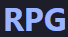

<div align="center">
  
</div><h3 align="center">RPG Battle Arena</h3>

<p align="center">
  Un gioco RPG a turni in JavaScript, progettato per mostrare una battaglia tra un eroe personalizzato e mostri casuali.
  <br />
  <a href="https://github.com/StrikeAspect/RPG"><strong>Esplora la documentazione »</strong></a>
  <br />
  <p align="center">
    <a href="https://strikeaspect.github.io/RPG/" target="_blank" rel="noopener noreferrer" style="display: inline-block; padding: 10px 20px; background-color: #202B67; color: white; border-radius: 5px; text-decoration: none; font-weight: bold;">Live Preview</a>
    <a href="https://ko-fi.com/rf_creator" target="_blank" rel="noopener noreferrer" style="display: inline-block; padding: 10px 20px; background-color: #5CE1E6; color: white; border-radius: 5px; text-decoration: none; font-weight: bold; margin-left: 10px;">
      <svg role="img" viewBox="0 0 24 24" xmlns="http://www.w3.org/2000/svg" style="display: inline-block; width: 1em; height: 1em; margin-right: 5px; vertical-align: middle;">
        <title>Ko-fi</title>
        <path fill="currentColor" d="M11.351 2.715c-2.7 0-4.986.025-6.83.26C2.078 3.285 0 5.154 0 8.61c0 3.506.182 6.13 1.585 8.493 1.584 2.701 4.233 4.182 7.662 4.182h.83c4.209 0 6.494-2.234 7.637-4a9.5 9.5 0 0 0 1.091-2.338C21.792 14.688 24 12.22 24 9.208v-.415c0-3.247-2.13-5.507-5.792-5.87-1.558-.156-2.65-.208-6.857-.208m0 1.947c4.208 0 5.09.052 6.571.182 2.624.311 4.13 1.584 4.13 4v.39c0 2.156-1.792 3.844-3.87 3.844h-.935l-.156.649c-.208 1.013-.597 1.818-1.039 2.546-.909 1.428-2.545 3.064-5.922 3.064h-.805c-2.571 0-4.831-.883-6.078-3.195-1.09-2-1.298-4.155-1.298-7.506 0-2.181.857-3.402 3.012-3.714 1.533-.233 3.559-.26 6.39-.26m6.547 2.287c-.416 0-.65.234-.65.546v2.935c0 .311.234.545.65.545 1.324 0 2.051-.754 2.051-2s-.727-2.026-2.052-2.026m-10.39.182c-1.818 0-3.013 1.48-3.013 3.142 0 1.533.858 2.857 1.949 3.897.727.701 1.87 1.429 2.649 1.896a1.47 1.47 0 0 0 1.507 0c.78-.467 1.922-1.195 2.623-1.896 1.117-1.039 1.974-2.364 1.974-3.897 0-1.662-1.247-3.142-3.039-3.142-1.065 0-1.792.545-2.338 1.298-.493-.753-1.246-1.298-2.312-1.298"/>
      </svg>
      Leave a coffee
    </a>
  </p>
<!-- TABLE OF CONTENTS -->
<details>
  <summary>Sommario</summary>
  <ol>
    <li>
      <a href="#rpg-battle-arena">RPG Battle Arena</a>
      <ul>
        <li><a href="#sommario">Sommario</a></li>
        <li><a href="#descrizione-del-progetto">Descrizione del progetto</a></li>
        <li><a href="#struttura-del-repository">Struttura del repository</a></li>
        <li><a href="#tecnologie">Tecnologie</a></li>
        <li><a href="#funzione-del-gioco">Funzione del gioco</a></li>
        <li><a href="#caratteristiche">Caratteristiche</a></li>
        <li><a href="#requisiti">Requisiti</a></li>
        <li><a href="#installazione">Installazione</a></li>
        <li><a href="#come-giocare">Come giocare</a></li>
        <li><a href="#meccaniche-di-gioco">Meccaniche di gioco</a></li>
        <li>
          <a href="#personaggi">Personaggi</a>
          <ul>
            <li><a href="#eroe">Eroe</a></li>
            <li><a href="#mostri">Mostri</a></li>
          </ul>
        </li>
      </ul>
    </li>
  </ol>
</details>

## Descrizione del progetto

Questo progetto è una piccola demo di gioco in-browser realizzata in JavaScript vanilla. L'obiettivo è creare una semplice esperienza RPG con un flusso di battaglia a turni e una UI immediata.

## Struttura del repository

```text
/
├── index.html    # Pagina gioco e UI
├── rpg.js        # Logica del gioco a turni
└── README.md     # Documentazione del progetto
```

## Tecnologie

* [](https://developer.mozilla.org/en-US/docs/Glossary/HTML5)
* [](https://developer.mozilla.org/en-US/docs/Web/CSS)
* [](https://developer.mozilla.org/en-US/docs/Web/JavaScript)


Progetto realizzato come esercizio per migliorare le abilità JavaScript e l'interazione con il DOM.

## Funzione del gioco

Il gioco permette di:
- creare un eroe con nome personalizzato;
- affrontare un mostro casuale (Goblin, Orco o Drago);
- scegliere tra attacco, cura o fuga;
- visualizzare l'esito di ogni turno tramite un log in pagina;
- vedere le statistiche dei personaggi anche nella console del browser.

## Caratteristiche

- Sistema di combattimento a turni
- Statistiche dinamiche per eroe e mostro
- Log di battaglia in HTML
- Elenco dei personaggi nella console
- UI semplice e navigabile

## Requisiti

- Un browser moderno (Chrome, Firefox, Edge, Safari)
- Nessuna installazione richiesta

## Installazione

1. Clona la cartella del progetto o scarica i file.
2. Apri `index.html` in un browser.

> Il progetto non richiede server o build tool: basta un semplice file system browser.

## Come giocare

1. Apri `index.html` nel browser.
2. Inserisci il nome del tuo eroe nel prompt.
3. Scegli una delle azioni disponibili:
   - `Attacca`
   - `Cura`
   - `Fuggi`
4. Segui il registro di battaglia nella schermata per sapere cosa succede.
5. Premi `Nuova Battaglia` per ricominciare con un nuovo mostro.

## Meccaniche di gioco

- `Attacca`: calcola danno come `attacco - difesa`
- `Cura`: ripristina 20 punti vita fino a un massimo di 100
- `Fuggi`: tenta la fuga con una probabilità basata sul mostro
- Il mostro contrattacca dopo ogni azione del giocatore, se ancora in vita
- Il gioco termina quando i punti vita dell'eroe o del mostro raggiungono 0, oppure quando la fuga riesce

## Personaggi

Sono presenti due tipi di personaggi:

### Eroe
- Nome personalizzato dall'utente
- Vita massima: 100
- Attacco e difesa generati casualmente
- 3 cure disponibili

### Mostri
- Goblin
- Orco
- Drago

Ogni mostro ha statistiche diverse e una probabilità di fuga specifica.

> All'inizio di ogni battaglia, le statistiche dell'eroe e dei mostri vengono stampate anche nella console del browser.
